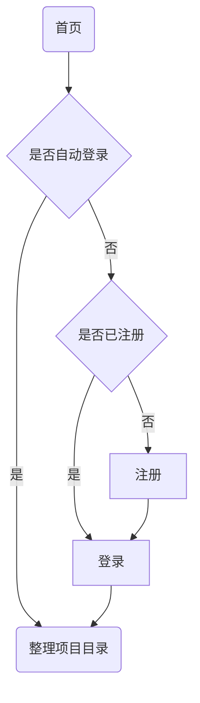
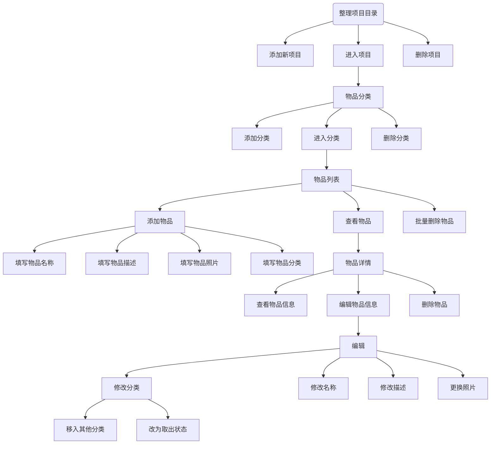

# 使用流程
*流程图使用mermaid语法*

***
## 登录与注册

```mermaid
graph TD
    首页(首页)-->是否自动登录{是否自动登录}
    是否自动登录--是-->整理项目目录[整理项目目录]
    是否自动登录--否-->是否注册{是否已注册}
    是否注册{是否已注册}--是-->登录[登录]
    登录-->整理项目目录(整理项目目录)
    是否注册--否-->注册[注册]
    注册[注册]-->登录[登录]
```

***
## 进入具体物品详情

```mermaid
graph TD
    整理项目目录(整理项目目录)-->添加新项目[添加新项目]
    整理项目目录(整理项目目录)-->进入项目[进入项目]
    整理项目目录(整理项目目录)-->删除项目[删除项目]
    进入项目-->物品分类[物品分类]
    物品分类-->添加分类[添加分类]
    物品分类-->进入分类[进入分类]
    物品分类-->删除分类[删除分类]
    进入分类-->物品列表[物品列表]
    物品列表-->添加物品[添加物品]
    添加物品-->填写物品名称[填写物品名称]
    添加物品-->填写物品描述[填写物品描述]
    添加物品-->填写物品照片[填写物品照片]
    添加物品-->填写物品分类[填写物品分类]
    物品列表-->查看物品[查看物品]
    物品列表-->批量删除物品[批量删除物品]
    查看物品-->物品详情[物品详情]
    物品详情-->查看物品信息[查看物品信息]
    物品详情-->编辑物品信息[编辑物品信息]
    物品详情-->删除物品[删除物品]
    编辑物品信息-->编辑[编辑]
    编辑-->修改分类[修改分类]
    编辑-->修改名称[修改名称]
    编辑-->修改描述[修改描述]
    编辑-->更换照片[更换照片]
    修改分类-->移入其他分类[移入其他分类]
    修改分类-->改为取出状态[改为取出状态]
```
